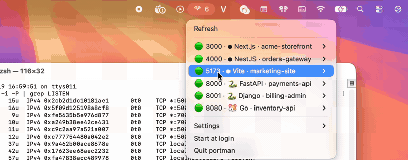

# portman

A tiny **menu-bar / system-tray** app that shows your running **dev servers**
(Node, Bun, Deno, Python, Go, Ruby, PHP, Java, Ollama, …) — with the detected
**project name** and **framework** — and lets you **kill**, **open**, or
**reveal** each one in a click. No more hunting for `kill -9 <pid>`.

OS daemons and other non-dev processes are filtered out, so you only see what
you actually started.

Runs on **macOS** (Intel + Apple Silicon) and **Ubuntu/Linux**. Built in Go for
a small footprint: a single binary, a few MB of RAM, and ~0% CPU while idle.



*(Full demo and the `lsof` commands it replaces: [forgebay.github.io/portman](https://forgebay.github.io/portman/))*

```
⌁ 3   ← live dev-server count on the menu bar
   Refresh
   ──────────────
   🟢 3000 · ⬢ Next.js · my-shop     ▸ http://localhost:3000
   🟢 5173 · ⬢ Vite · landing        ▸ Open in browser
   🟢 8000 · 🐍 FastAPI · billing     ▸ Copy URL · Open in VS Code
   🟢 11434 · 🦙 Ollama · ollama      ▸ Reveal in Finder · Kill
   ──────────────
   Settings ▸  (Refresh 5/15/30s · Show all ports)
   ☐ Start at login   ·   Quit portman
```

## Features

1. Shows only **dev servers** that are listening — Node, Bun, Deno, Python, Go,
   Rust, Elixir, Ruby, PHP, Java, .NET, Ollama — hiding OS/system processes.
   Each row has a **runtime glyph** and a **🟢/⚪ health dot** (does the port
   still accept connections?), and the menu-bar icon shows a **live count**.
2. **Auto-detects the project** from `package.json`, `pyproject.toml`, `go.mod`,
   `Cargo.toml`, `composer.json`, … (walks up from the process's working dir).
3. **Identifies the framework**: Next.js, Nuxt, Vite, Remix, Astro, SvelteKit,
   Gatsby, Qwik, SolidStart, RedwoodJS, Angular, Webpack, NestJS, FastAPI,
   Django, Flask, Rails, Laravel, Spring Boot, Phoenix, Axum/Actix/Rocket, …
4. Per-entry actions: **Open in browser**, **Copy URL**, **Open in VS Code**,
   **Reveal** the project folder, **Kill** (`SIGTERM`→`SIGKILL`) / force-kill;
   the submenu also shows the full URL plus **uptime**, PID, CPU and memory.
5. **Settings**: refresh cadence (5/15/30s) and a **Show all ports** escape
   hatch — persisted to `~/.config/portman/config.json`.
6. **Start at login** toggle, right in the menu.
7. Resource-efficient: lazy refresh + manual **Refresh**; per-PID metadata cache
   so manifests aren't re-read every tick; bounded concurrent health probes.
8. Small, modular Go codebase.

## Install

### npm (macOS + Linux, one command)

```sh
npm install -g @forgebay/portman
portman                 # launches into the menu bar / tray
```

`postinstall` downloads the prebuilt binary for your platform from the latest
release. On Linux, if the tray icon does not appear:

```sh
sudo apt-get install -y libgtk-3-0 libayatana-appindicator3-1
```


### Manual download

Grab the asset for your platform from the [Releases](../../releases) page:

- **macOS** — unzip `PortManager-macos-<arch>.zip`, move `Port Manager.app` to
  `/Applications`. Unsigned, so first launch: right-click → **Open**. Lives in
  the menu bar (no Dock icon).
- **Ubuntu/Linux** — extract `portman-linux-amd64.tar.gz` and run
  `./portman/install.sh`. On GNOME, enable the *AppIndicator and
  KStatusNotifierItem* extension so the tray icon appears.

## Auto-run at login

portman does **not** start automatically after install. To enable it, open the
tray menu and tick **Start at login** (untick to disable). Under the hood this
writes a macOS LaunchAgent (`~/Library/LaunchAgents/vn.forgebay.portman.plist`)
or an XDG autostart entry (`~/.config/autostart/portman.desktop`).

## Build from source

Requires Go 1.22+ and a C toolchain (CGO is used by the tray library).

```sh
# Linux build deps
sudo apt-get install -y gcc libgtk-3-dev libayatana-appindicator3-dev

go build -o portman ./cmd/portman
./portman
```

> CGO means the app **cannot be cross-compiled** — build on each target OS. The
> release workflow does this via a macos-14 / macos-13 / ubuntu matrix.

## Project layout

```
cmd/portman/        entrypoint (systray.Run on the main goroutine)
internal/model/     shared types (ListenPort, Lang)
internal/ports/     list listening ports via gopsutil (+ LISTEN filter, dedupe)
internal/runtime/   map a process to its runtime/language
internal/proc/      kill (SIGTERM→SIGKILL) and read CPU/memory stats
internal/tray/      systray menu: fixed item pool + refresh loop
build/macos/        Info.plist (LSUIElement) + .app bundler
build/linux/        .desktop launcher + per-user installer
```

## Permissions

portman manages **your own** processes. Ports owned by other users or the system
report no PID without elevation and are hidden. Killing another user's process
fails with a permission error (surfaced in the tray tooltip).

## Develop / test

```sh
go vet ./...
go test ./internal/...   # ports, runtime and proc are unit-tested headless
```
